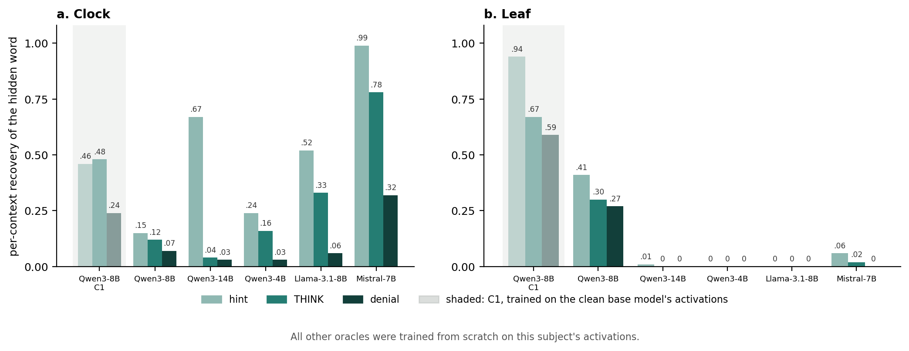
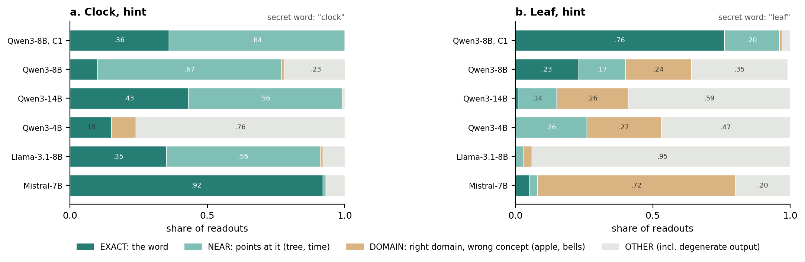
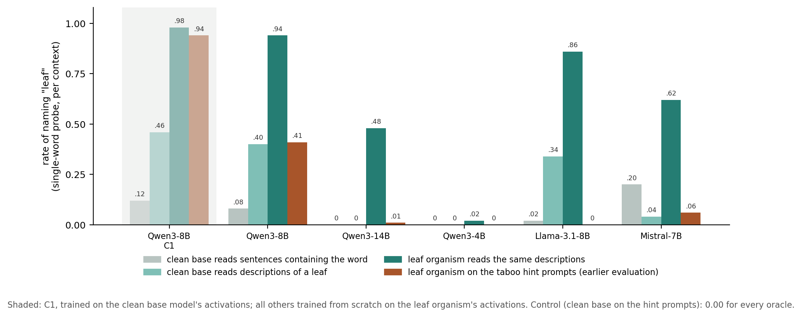
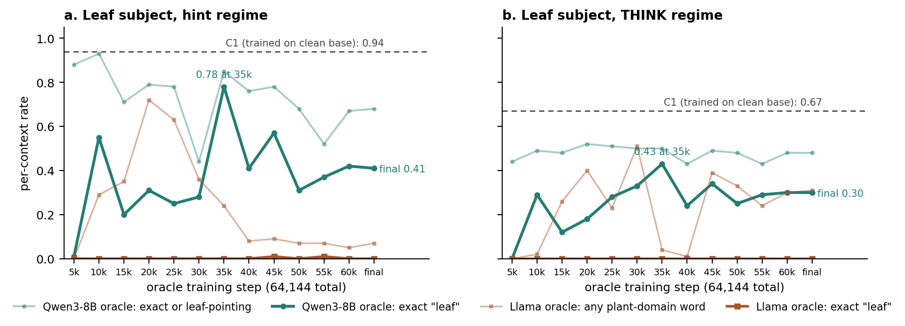

# Cross-model Activation Oracles on a concealing subject

**Executive summary (draft). Tobias Bersia, 1 to 5 September 2026.** Full record: `WRITEUP-DRAFT.md`, `results/RESULTS.md`.

**Question.** My ACL paper (arXiv 2607.23379) showed that an Activation Oracle fine-tuned on a Taboo subject becomes a concept-specific anti-reader (recovery 94% to 35%). Its backbone was the subject and its training activations came from it, so the anti-reading could sit in shared weights (A) or in the activations (B); a cross-model oracle is immune only under A.

**Setup.** Reference: Karvonen's released C1, a Qwen3-8B trained on the clean base model's activations. Ten full-recipe oracle trainings ($415) on two Qwen3-8B Taboo subjects: **clock** (my capstone organism; C1 reads its word at 0.46) and **leaf** (the paper's alpha = 1.0 subject; C1 reads it at 0.94). Every new oracle was trained on its subject's activations; backbones: Qwen3-8B (the subject's own base model), Qwen3-14B, Qwen3-4B, Llama-3.1-8B, Mistral-7B. Regimes: hint, denial, THINK, OFFTOPIC; the oracle reads the subject's state on the prompt alone, which never contains the word. Metric: per-context exact recovery, greedy.

*Figure 1. Recovery of the hidden word by regime.*

**Findings.**

1. *Privileged access is a fair-weather advantage, on both subjects* (Fig. 1). The oracle on the subject's own base model reads ordinary tasks best (0.77 to 0.99) and the concealed word worst (clock 0.46 to 0.15, leaf 0.94 to 0.41).
2. *On clock, anti-reading follows kinship, most clearly in THINK.* Asked to think about the word, every Qwen-family oracle trained on clock loses it (0.04 to 0.16 vs C1 0.48); the foreign ones keep reading (0.33, 0.78).
3. *On leaf, no from-scratch oracle with non-identical weights reads the word on the taboo prompts*, yet all reach the concept: leaf-pointing words in 24 to 42% of contexts (Fig. 2).

*Figure 2. What the readouts say, graded by hand.*

4. *Why they miss the word differs by oracle* (Fig. 4). Reading plain leaf texts through the clean base, the 14B and 4B never say "leaf" (they answer "plants", "photosynthesis"): a word aversion the oracle carries. Llama names it at near-C1 rates; its taboo zeros recur with no organism, a prompt artefact. Mistral names it when the token is present but rarely resolves a description to it. The kin 8B behaves like C1. Whether training on the leaf subject caused it is open.

*Figure 4. Can each oracle say "leaf" at all?*

5. *The kin oracle reads the word mid-training and then loses it* (Fig. 3). Hint recovery peaks at 0.78 at step 35k and ends at 0.41 (p = 1e-7): suppression developing during training, not a map never acquired; a trend to test.

*Figure 3. Leaf read with every saved checkpoint of its two oracles.*

6. *OFFTOPIC reports are trace detection when the trace is real.* Mistral-clock says "clock" on 39% of arithmetic prompts, where the paper's probes decode the concept at about 1.0: detection, not miscalibration.

**For auditing.** On clock a foreign backbone escaped the Qwen-family blind spot (Mistral read above C1). On leaf none did, for three different reasons, so exact-word recovery on taboo prompts misreads what these oracles know. The one robust reader, C1, needs the clean base model, which a fine-tuned model without a clean twin lacks.

**Next.** Clock-trained oracles reading the same leaf texts (did training on the leaf subject cause the aversion?); probes inside the oracles; the alpha x protocol grid for leaf vs clock; an evaluation with THINK primary, no-trace floors and a graded P(secret token) metric.

**Limitations.** One seed, 100 prompts per regime, 50 texts per half in the resolution test, two subjects on one base model; Llama-leaf resumed after a crash (last 14%).
