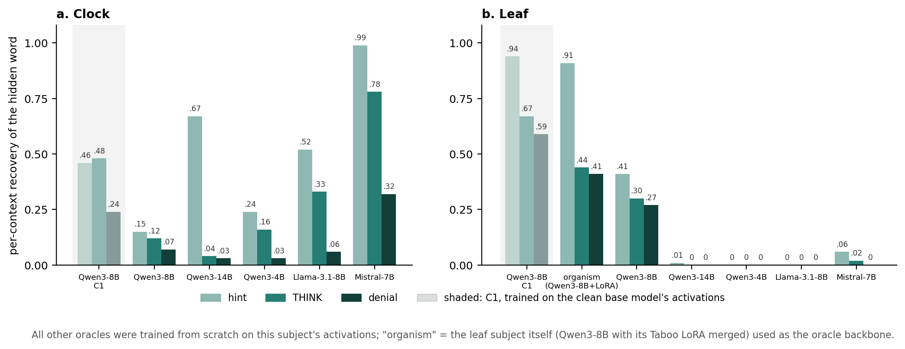
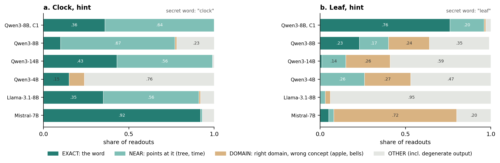
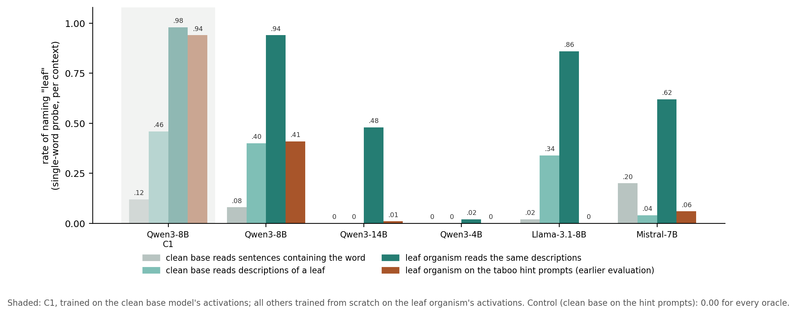
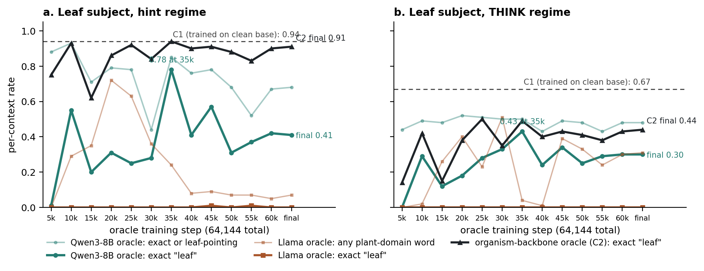

# Cross-model Activation Oracles on a concealing subject

**Executive summary (draft). Tobias Bersia, 1 September to 2 October 2026.** Full record: `WRITEUP-DRAFT.md`, `results/RESULTS.md`.

**Question.** My ACL paper (arXiv 2607.23379) reported that an Activation Oracle fine-tuned on a Taboo subject becomes a concept-specific anti-reader (recovery 94% to 35%). Its co-author has since found that the paper's evaluation omitted the Taboo LoRA; on the correct stack most of the effect disappears. This project asked whether an oracle with a different backbone escapes anti-reading. The answer reverses the premise: anti-reading appears *because* the backbone differs.

**Setup.** Reference: Karvonen's released C1, a Qwen3-8B trained on the clean base model's activations. Eleven full-recipe trainings ($472) on two Qwen3-8B Taboo subjects, **clock** (my capstone organism; C1 reads its word at 0.46) and **leaf** (the paper's alpha = 1.0 subject; 0.94). Every oracle was trained on its subject's activations; backbones: Qwen3-8B, Qwen3-14B, Qwen3-4B, Llama-3.1-8B, Mistral-7B on each subject, plus, on leaf, the organism itself (Qwen3-8B with its Taboo LoRA merged, the paper's Taboo-AO setup done right). Regimes: hint, denial, THINK, OFFTOPIC, read from the prompt alone, which never contains the word. Metric: per-context exact recovery, greedy.

*Figure 1. Recovery of the hidden word by regime.*

**Findings.**

1. *The matched oracle shows no anti-reading in hint and a 20-point loss when the subject only thinks.* The organism-backbone oracle reads leaf at 0.91 (C1 0.94, p = 0.59), 0.44 in THINK (C1 0.67) and 0.41 in denial (C1 0.59), the same profile as the paper's FT-AO on the correct stack (0.92 / 0.50 / 0.48). The loss is not word-specific: the paper's moon oracle reads leaf at C1's level everywhere, the wave oracle drops like leaf's own.
2. *Anti-reading in these data is a backbone-mismatch effect.* Trained on the same leaf activations, the clean Qwen3-8B reads 0.41 and the 14B, 4B, Llama and Mistral at most 0.06. On clock the loss follows kinship (Qwen family 0.04 to 0.16 in THINK vs C1 0.48; Llama 0.33, Mistral 0.78).
3. *The non-matching oracles reach the concept and miss the word in different ways* (Figs. 2, 4). The 14B and 4B never say "leaf" even reading plain leaf text through the clean base (a word aversion); Llama names it at near-C1 rates and fails only on taboo prompts (a prompt artefact); Mistral reads the token but rarely resolves descriptions to it.

*Figure 2. What the readouts say, graded by hand.*

*Figure 4. Can each oracle say "leaf" at all?*

4. *Trajectories* (Fig. 3). The organism-backbone oracle reaches C1's level by step 10k and holds it; the clean-backbone twin peaks at 0.78 at 35k and decays to 0.41.

*Figure 3. Leaf read at every checkpoint of three oracles.*

5. *OFFTOPIC reports are trace detection when the trace is real.* Mistral-clock says "clock" on 39% of arithmetic prompts, where the paper's probes decode the concept near 1.0.

**For auditing.** The oracle an auditor can always build, on the audited model's own weights, reads what it hides as well as a clean-trained oracle when the model hints, and about 20 points worse when it only thinks. A different backbone trained on the same activations reads worse still, down to zero. Cross-model offers no immunity; the matched oracle is the better default, and THINK prompts are where its weakness shows.

**Next.** Replicate the matched oracle on clock and a second word; probe inside the oracles; clock-trained oracles reading the leaf texts (did organism training cause the word aversion?); an evaluation with THINK primary and no-trace floors.

**Limitations.** One seed, 100 prompts per regime, two cross words, two subjects on one base model; Llama-leaf resumed after a crash (last 14%).
